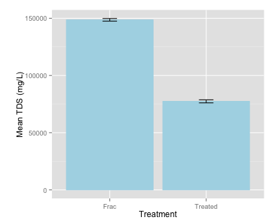

Lab 1--Total Dissolved Solids analysis
========================================================
Before starting an R session, you must call up the R-packages needed for your analysis.


```r
library(plyr)
library(ggplot2)
```


Total dissolved solids measurements are reported below.


```r
Frac <- c(149660, 148620, 148060, 148231)
Treated <- c(77820, 76160, 77840, 77830)
```


Create a data fram with the two sample types to make it easier to conduct analysis and make plots""

```r
Frac_samp <- data.frame(SampleType = c(rep("Frac", 4), rep("Treated", 4)), TDS = c(Frac, 
    Treated))
```

OK, now the fun part, we want to determine if the treated water contains significantly less TDS than the untreated water. We will adress this question in two ways: (1) plot the mean values of each sample type and include error bars that represent 95% confidence intervals; (2) conduct a two-sample t-test anda Wilcoxon Signed Rank Test to determine if the data sets are significantly different.

To plot the mean values ± 95% CIs, we must first calculate the mean and standard error.


```r
se <- function(x) sd(x)/sqrt(length(x))
Frac_new <- ddply(Frac_samp, .(SampleType), summarize, mean = mean(TDS), CI = qt(0.975, 
    3) * se(TDS))
```

Plot the means as bar graphs with error bars that represnet 95% confidence intervals:

```r
ggplot(Frac_new, aes(x = SampleType, y = mean, ymin = mean - CI, ymax = mean + 
    CI)) + geom_bar(stat = "identity", color = "light blue", fill = "light blue") + 
    geom_errorbar(width = 0.15) + labs(x = "Treatment", y = "\nMean TDS (mg/L)")
```

 


Now do a t-test


```r
t.test(TDS ~ SampleType, data = Frac_samp, var.equal = FALSE)
```

```
## 
## 	Welch Two Sample t-test
## 
## data:  TDS by SampleType
## t = 129.4, df = 5.867, p-value = 2.303e-11
## alternative hypothesis: true difference in means is not equal to 0
## 95 percent confidence interval:
##  69876 72585
## sample estimates:
##    mean in group Frac mean in group Treated 
##                148643                 77412
```


